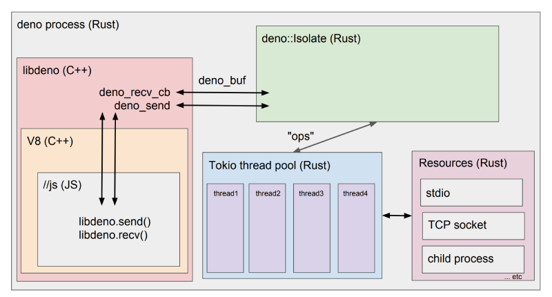

# Deno

Deno ([/ˈdiːnoʊ/](http://ipa-reader.xyz/?text=%CB%88di%CB%90no%CA%8A), 发音 `dee-no`) 是一个 JavaScript/TypeScript 的运行时，默认使用安全环境执行代码

Deno 含有以下功能亮点：

- 默认安全。外部代码没有文件系统、网络、环境的访问权限，除非显式开启。
- 支持开箱即用的 TypeScript 的环境。
- 只分发一个独立的可执行文件（deno）。
- 有着内建的工具箱，比如一个依赖信息查看器（deno info）和一个代码格式化工具（deno fmt）。
- 有一组经过审计的标准模块，保证能在 Deno 上工作。
- 脚本代码能被打包为一个单独的 JavaScript 文件。

Deno 是一个跨平台的运行时，即基于 Google V8 引擎的运行时环境，该运行时环境是使用 Rust 语言开发的，并使用 Tokio 库来构建事件循环系统。Deno 建立在 V8、Rust 和 Tokio 的基础上，它的架构如下：



1、Rust 是由 Mozilla 主导开发的通用、编译型编程语言。设计准则为 “安全、并发、实用“，支持函数式、并发式、过程式以及面向对象的编程风格。Deno 使用 Rust 语言来封装 V8 引擎，通过 libdeno 绑定，我们就可以在 JavaScript 中调用隔离的功能。

2、Tokio 是 Rust 编程语言的异步运行时，提供异步事件驱动平台，构建快速，可靠和轻量级网络应用。利用 Rust 的所有权和并发模型确保线程安全。Tokio 构建于 Rust 之上，提供极快的性能，使其成为高性能服务器应用程序的理想选择。在 Deno 中 Tokio 用于并行执行所有的异步 IO 任务。

3、V8 是一个由 Google 开发的开源 JavaScript 引擎，用于 Google Chrome 及 Chromium 中。V8 在运行之前将JavaScript 编译成了机器代码，而非字节码或是解释执行它，以此提升性能。更进一步，使用了如内联缓存（inline caching）等方法来提高性能。有了这些功能，JavaScript 程序与 V8 引擎的速度媲美二进制编译。在 Deno 中，V8 引擎用于执行 JavaScript 代码。

4、Deno与Node.js的核心模型是一致的，都是异步非阻塞I/O。所以Deno与Node.js在使用场景上基本一致，适合I/O密集型，不适用于CPU密集型。开发中要避免使用同步I/O和复杂计算场景。

## 官方文档

- 首页：[https://deno.land/](https://deno.land/)

- 官方文档：[Introduction | Manual | Deno](https://deno.land/manual)

- 官方API：https://doc.deno.land/deno/stable

- 官方标准库地址：[https://deno.land/std](https://deno.land/std@0.142.0)

- 第三方库地址：https://deno.land/x

## 安装Deno

```shell
# Shell (Mac, Linux):
$ curl -fsSL https://deno.land/install.sh | sh

# PowerShell (Windows):
$ iwr https://deno.land/install.ps1 -useb | iex

# Homebrew (Mac):
$ brew install deno

# Chocolatey (Windows):
$ choco install deno

# Scoop (Windows):
$ scoop install deno

# Build and install from source using Cargo:
$ cargo install deno --locked
```

更新Deno 版本，您可以运行：

```shell
deno upgrade
```

更新安装特定版本的 Deno：

```shell
deno upgrade --version 1.0.1
```

## Deno cli命令行

```shell
# 以 REPL 模式启动：
$ deno
# 执行一个脚本：
$ deno run https://deno.land/std/examples/welcome.ts
# 在 Shell 中执行一段代码：
$ deno eval "console.log(30933 + 404)"
```

### 26 个通用指令

结合 deno --help 中出现的选项以及通常也会在 14 个内置工具包的帮助信息中看到的选项，将通用指令整理在这里做一个通览（只要某指令被使用两次及以上便视为通用指令，几乎涵盖了所有）：

| 序号  | 选项                             | 哪些工具可以使用？                                                                  | 用途                                                                |
| --- | ------------------------------ | -------------------------------------------------------------------------- | ----------------------------------------------------------------- |
| 01  | -h, --help                     | 全部                                                                         | 打印帮助信息                                                            |
| 02  | -L, --log-level                | 全部                                                                         | 设置日志级别 [可能的值: debug, info]                                        |
| 03  | -q, --quiet                    | 全部                                                                         | 禁止诊断输出；默认情况下，子命令会将可读性友好的诊断消息打印到 stderr；如果设置了这个标志，则将这些消息限制为 errors |
| 04  | -A, --allow-all                | run, install, test                                                         | 允许所有权限，这将禁用所有安全限制                                                 |
| 05  | --allow-env                    | run, install, test                                                         | 允许环境访问，例如读取和设置环境变量                                                |
| 06  | --allow-hrtime                 | run, install, test                                                         | 允许高精度时间测量，高精度时间能够在计时攻击和特征识别中使用                                    |
| 07  | --allow-net=                   | run, install, test                                                         | 允许网络访问。可以指定一系列用逗号分隔的域名，来提供域名白名单                                   |
| 08  | --allow-plugin                 | run, install, test                                                         | 允许加载插件。请注意：这目前是一个不稳定功能                                            |
| 09  | --allow-read=                  | run, install, test                                                         | 允许读取文件系统。可以指定一系列用逗号分隔的目录或文件，来提供文件系统白名单。                           |
| 10  | --allow-run                    | run, install, test                                                         | 允许运行子进程。请注意，子进程不在沙箱中运行，因此没有与 deno 进程相同的安全限制，请谨慎使用                 |
| 11  | --allow-write=                 | run, install, test                                                         | 允许写入文件系统。您可以指定一系列用逗号分隔的目录或文件，来提供文件系统白名单                           |
| 12  | --watch                        | run, test, compile, fmt                                                    | 每当磁盘上更改其中一个监视文件时，程序将自动重新启动                                        |
| 13  | --cert                         | run, install, bundle, chche, eval, info, test, upgrade, repl               | 从 PEM 编码的文件中加载证书颁发机构                                              |
| 14  | -c, --config                   | run, install, budle, cache, test                                           | 读取 tsconfig.json 配置文件                                             |
| 15  | --check                        | run                                                                        |                                                                   |
| 14  | --unstable                     | run, install, bundle, cache, doc, eval, fmt, info, lint, test, types, repl | 开启不稳定的 APIs 支持                                                    |
| 15  | --inspect=HOST:PORT            | run, eval, test, repl                                                      | 激活监听器 主机:端口 (默认: 127.0.0.1:9229)                                  |
| 16  | --inspect-brk=HOST:PORT        | run, eval, test, repl                                                      | 在 主机:端口 上激活监听器，并在用户脚本启动时中断                                        |
| 17  | --v8-flags=                    | run, eval, test, repl                                                      | 设置 V8 命令行选项。帮助： --v8-flags=--help                                 |
| 18  | --cached-only                  | run, test                                                                  | 要求远程依赖项已经被缓存                                                      |
| 19  | -r, --reload=<CACHE_BLOCKLIST> | run, cache, doc, test                                                      | 重新加载源代码缓存（重新编译TypeScript）。重新加载全部/仅标准模块/特定模块                       |
| 20  | --lock                         | run, bundle, cache, test                                                   | 检查指定的锁文件                                                          |
| 21  | --lock-write                   | run, bundle, cache, test                                                   | 写入锁文件，和 --lock 一起使用                                               |
| 22  | --no-check                     | run, cache, info, test                                                     | 禁用 TypeScript 的类型检查，这会大大减少程序的启动时间                                 |
| 23  | --no-remote                    | run, cache, test                                                           | 不解析远程模块                                                           |
| 24  | --seed                         | run, test                                                                  | Math.random() 种子                                                  |
| 25  | --importmap                    | run, install, bundle, test                                                 | 不稳定：读取 import map 文件                                              |
| 26  | --json                         | doc, info                                                                  | 以 JSON 格式输出文档                                                     |


#### (01) --log-level/--quiet

这两个指令所有内置工具都可以使用。

在 --log-level 中，可以加入 debug 或 info 参数 来设置日志等级。其中设置为 debug 时会出现如下信息。此时是非常详细的信息，一个简单的启动和网络访问都会打印出很多行的日志来。

```bash
$ deno run --allow-net --log-level debug main.ts
DEBUG RS - deno_runtime::permissions:60 - ⚠️️  Granted net access to "deno.land"
DEBUG RS - deno::file_fetcher:258 - FileFetcher::fetch_cached - specifier: https://deno.land/std@0.185.0/media_types/vendor/mime-db.v1.52.0.ts
DEBUG RS - deno::npm::resolution:299 - Snapshot already up to date. Skipping pending resolution.
DEBUG RS - deno::module_loader:188 - Prepared module load.
DEBUG RS - deno_runtime::permissions:60 - ⚠️️  Granted net access to "0.0.0.0:8080"
```

--quiet 目的之一是解决多次运行同一程序但获得到不同的输出的情况。

#### (02) --unstable/--cert/--config[§](https://deno-tutorial.js.org/articles/architecture/cli/deno-cli-v1-function.html#02---unstable--cert--config)

这三个指令是除了所有指令都能用到的 --log-level 和 --quiet 外，被使用量最大的前三名。

--unstable 允许程序执行时使用不稳定的 API 列表。什么样的 API 是不稳定的？官网文档这么解答：

> 纵使 Deno v1 开始 Deno 命名空间的 API 稳定起来，但并非 Deno 的所有功能都可以投入生产。由于尚未准备就绪的功能仍处于草稿阶段，因此将其锁定在 --unstable 命令行标志后面。

不稳定的 API 大多没有经过安全性检查，将来可能会发生重大的 API 更改，并且尚未准备好投入生产环境。

同时，Deno 的标准模块（https://deno.land/std/）也尚不稳定。当前 Deno 对标准模块的版本与 CLI 不同，以强调不稳定这一特点。 请注意，与 Deno 命名空间不同，使用标准模块不需要 --unstable 标志（除非标准模块本身使用了不稳定的 Deno 功能）。测试方式：

```bash
$ deno install --unstable --allow-read --allow-write --allow-net https://deno.land/x/pagic/mod.ts
```

--cert 用来从 PEM 编码的文件中加载证书颁发机构。那么问题来了：

- **什么是 PEM**？PEM 这是一种容器格式，可以只包含公共证书，或者可以包括完整的证书链，包括公共密钥，私钥和根证书；名称来源于网络安全领域一款增强安全的私人邮件类型 Privacy Enhanced Mail。
- **PEM 格式**？以"-----BEGIN..."开头, "-----END..."结尾，内容是 ASCII（Base64）编码。
- **查看 PEM 格式证书的信息**？openssl x509 -in certificate.pem -text -noout。

--config 用来读取 tsconfig.json 文件，当然也可以读取其它名称的文件来当作 tsconfig.json。

```bash
deno run --allow-net main.ts --config tsconfig.json
```

#### (03) --inspect*/--v8-flags[§](https://deno-tutorial.js.org/articles/architecture/cli/deno-cli-v1-function.html#03---inspect--v8-flags)

这几个指令均只能在 run、eval、test 或 repl 四个工具包中使用。

Deno 支持 V8 Inspector Protocol，使用 --inspect 或 --inspect-brk 指令可以在 Chrome Devtools 或其他支持该协议的客户端（比如 VSCode）上调试 Deno 程序。

--inspect 允许在任何时间点连接调试器，而 --inspect-brk 选项会等待调试器连接，在第一行代码处暂停执行。输入以下代码，打开 chrome://inspect，点击 target 旁边的 Inspect 进行调试测试：

```bash
$ deno run --inspect-brk --allow-read --allow-net https://deno.land/std/http/file_server.ts
Debugger listening on ws://127.0.0.1:9229/ws/4947ac73-b9fc-4fd2-9336-c6071f4f3e9e
Debugger session started.
Debugger session ended: WebSocket protocol error: Connection reset without closing handshake.
HTTP server listening on http://0.0.0.0:4507/
```

--v8-flags 负责设置 v8 的命令行选项。可以这样了解具体参数：

```bash
$ deno run --v8-flags=--help main.ts
SSE3=1 SSSE3=1 SSE4_1=1 SSE4_2=1 SAHF=1 AVX=1 FMA3=1 BMI1=1 BMI2=1 LZCNT=1 POPCNT=1 ATOM=0
Synopsis:
  shell [options] [--shell] [<file>...]
  d8 [options] [-e <string>] [--shell] [[--module] <file>...]
...
```

#### (04) --allow-*

--allow-* 作为一个整体，只被 run、install 和 test 三个工具分别使用，其中包括：

- -A, --allow-all：允许所有权限，这将禁用所有安全限制。
- --allow-env：允许环境访问，例如读取和设置环境变量
- --allow-hrtime：允许高精度时间测量，高精度时间能够在计时攻击和特征识别中使用
- --allow-net：允许网络访问。可以指定一系列用逗号分隔的域名，来提供域名白名单
- --allow-plugin：允许加载插件。请注意：这目前是一个不稳定功能
- --allow-read：允许读取文件系统。可以指定一系列用逗号分隔的目录或文件，来提供文件系统白名单。
- --allow-run：允许运行子进程。请注意，子进程不在沙箱中运行，因此没有与 deno 进程相同的安全限制，请谨慎使用
- --allow-write：允许写入文件系统。您可以指定一系列用逗号分隔的目录或文件，来提供文件系统白名单

在 Denon （监听 Deno 应用程序中的所有更改并自动重新启动，还可以配置更多功能）中，可以这样简单的设置在 denon.config.ts 中：

```bash
import { DenonConfig } from "https://deno.land/x/denon/mod.ts"
import { config as env } from "https://deno.land/x/dotenv/mod.ts"

const config: DenonConfig = {
  scripts: {
    start: {
      allow: [ "env", "net", "read", "write", "plugin" ],
      ...
}

export default config
```

执行 denon start 这将默认替换为：

```bash
$ deno run --allow-net --allow-env --allow-write --allow-read --allow-plugin --unstable main.ts
```

#### (05) --cached-only/--seed[§](https://deno-tutorial.js.org/articles/architecture/cli/deno-cli-v1-function.html#05---cached-only--seed)

这两个指令只被 run 和 test 工具使用。

--cached-only 要求远程依赖已经被缓存，当我们使用这个指令从远程找一个没有缓存过其软件包的 Deno 程序执行的时候，会报错无法从缓存中找到这个软件包：

```bash
$ deno run --allow-net --cached-only not-cache.ts
error: Cannot find module "https://deno.land/x/alosaur@v0.21.1/mod.ts"
from "file:///Users/{$HOME}/WorkSpace/Hylerrix/deno-tutorial/...demos/ningowood/v1-cli-example/not-cache.ts" in cache, --cached-only is specified
```

--seed 为程序提供种子随机值。程序怎么获取这个随机值？留下来以后思考。

```bash
$ deno run --allow-net --seed 1 main.ts
```

#### (06) --reload/--lock*/.--no-*

这五个指令是剩余的最后指令，分别被以下工具使用：

- --reload：run, cache, doc, test
- --lock：run, bundle, cache, test
- --lock-write：run, bundle, cache, test
- --no-check：run, cache, info, test
- --no-remote：run, cache, test

--reload 将重新缓存源码，并重新编译 TypeScript，其中又包括：

- --reload：重新加载所有源码
- --reload=https://deno.land/std：重新缓存标准库源码
- --reload=https://deno.land/std/fs/utils.ts,[https://deno.land/std/fmt/colors.ts：重新缓存指定的多个源码列表](https://deno.land/std/fmt/colors.ts%EF%BC%9A%E9%87%8D%E6%96%B0%E7%BC%93%E5%AD%98%E6%8C%87%E5%AE%9A%E7%9A%84%E5%A4%9A%E4%B8%AA%E6%BA%90%E7%A0%81%E5%88%97%E8%A1%A8)

--lock 和 --lock-write 用来检查锁文件，因为在眼花缭乱的各大库的多版本中，管理、锁定文件版本也是很重要的；--no-check 禁用 TypeScript 的类型检查，从而大大减少程序的启动时间；--no-remote 来不解析远程模块。

```bash
$ deno run --allow-net --reload main.ts
$ deno run --allow-net --lock lock.json main.ts
Subresource integrity check failed --lock=lock.json
https://deno.land/std@0.63.0/textproto/mod.tsa
$ deno run --allow-net --no-check main.ts
$ deno run --allow-net --no-remote main.ts
```

### 14 个内置工具包

介绍了 14 个内置工具

| 序号  | 名称     | 命令           | 功能                                  |
| --- | ------ | ------------ | ----------------------------------- |
| 01  | 运行器    | deno run     | 运行指定文件名或 URL 程序。 使用“-”作为文件名从标准输入中读取 |
| 02  | 初始化项目器 | deno init    | 生成deno项目                            |
| 02  | 脚本安装器  | deno install | 将脚本安装为可执行文件                         |
| 03  | 打包器    | deno bundle  | 将模块和依赖项打包到单个文件中                     |
| 04  | 缓存器    | deno cache   | 缓存依赖                                |
| 05  | 文档生成器  | deno doc     | 显示某模块的文档                            |
| 06  | 执行器    | deno eval    | 执行一段脚本                              |
| 07  | 格式化器   | deno fmt     | 格式化源文件                              |
| 08  | 依赖检查器  | deno info    | 显示有关缓存的信息或与源文件相关的信息                 |
| 09  | 规范器    | deno lint    | 规范化源文件                              |
| 10  | 测试器    | deno test    | 执行测试                                |
| 11  | 类型器    | deno types   | 打印运行时 TypeScript 声明                 |
| 12  | 补全器    | deno compile | 会将脚本编译为独立的可执行文件                     |
| 13  | 升级器    | deno upgrade | 将 Deno 可执行文件升级到给定版本                 |
| 14  | REPL 器 | deo repl     | 读取/执行/打印/循环                         |

#### (01) 运行器：deno run

run 工具支持近乎 100% 的通用指令列表（--json 指令除外），且上一个章节的通用指令示例都以 run 工具来举例，这里无需多讲。

- deno-run：执行一个模块程序，可以是一个文件名或 URL 地址。
- 使用方式：`deno run [OPTIONS] <脚本参数>...`
- 常用示例：

```bash
# 默认情况下所有的程序都会运行在安全沙盒中，无法访问硬盘、网络或生成子进程。
$ deno run https://deno.land/std/examples/welcome.ts
# 给予所有权限
$ deno run -A https://deno.land/std/http/file_server.ts
# 给予读取权限和网络监听权限：
$ deno run --allow-read --allow-net https://deno.land/std/http/file_server.ts
# 给予允许读取权限的硬盘目录白名单：
$ deno run --allow-read=/etc https://deno.land/std/http/file_server.ts
# Deno 允许指定文件名 “-” 以从 stdin 中读取文件。
$ curl https://deno.land/std/examples/welcome.ts | target/debug/deno run -
```

#### (02) 脚本安装器：deno install

- deno-install：将脚本作为可执行文件安装在安装路`径的根目录的 bin 目录中。
- 使用方式：`deno install [OPTIONS] <命令>...`
- 独特指令：
  - `-f, --force`：强制覆盖现有安装
  - `-n, --name <NAME>`：可执行文件名
  - `--root <PATH>`：安装路径
- 常用示例：

```bash
$ deno install --allow-net --allow-read https://deno.land/std/http/file_server.ts
$ deno install https://deno.land/std/examples/colors.ts
# 要更改可执行文件的名称，请使用 -n/-name：
$ deno install --allow-net --allow-read -n serve https://deno.land/std/http/file_server.ts
# 可执行文件名称默认情况下被推断：
#   - 尝试获取 URL 路径文件结构。正如上方上面的例子
#     become 'file_server'.
#   - 如果文件结构是通用名称（例如“main”、“mod”、“index”或“ cli”），并且该路径没有父级，则采用父级路径的文件名。否则，使用通用名称解决。
# 要更改安装根目录，请使用 --root：
$ deno install --allow-net --allow-read --root /usr/local https://deno.land/std/http/file_server.ts
# 按优先级确定安装路径的根目录：
#   - --root option
#   - DENO_INSTALL_ROOT 环境变量
#   - $HOME/.deno
# 如果需要，必须将它们手动添加到路径中。
```

#### (03) 打包器：deno bundle

- deno-bundle：打包。
- 使用方式：`deno bundle [OPTIONS] <source_file> [out_file]`
- 常用示例：

```bash
# 输入一个单独的 JavaScript 文件，其拥有所有相关依赖：
$ deno bundle https://deno.land/std/examples/colors.ts colors.bundle.js
# 如果没有指定输入文件，输入将会写入到标准输出流中：
$ deno bundle https://deno.land/std/examples/colors.ts
```

#### (04) 缓存器：deno cache[§](https://deno-tutorial.js.org/articles/architecture/cli/deno-cli-v1-function.html#04-%E7%BC%93%E5%AD%98%E5%99%A8deno-cache)

- deno-cache：递归地缓存并编译远程依赖
- 使用方式：`deno cache [OPTIONS] <file>...`
- 常用示例：

```bash
# 下载并编译包括所有静态依赖项的模块并保存在
# 本地缓存中，无需运行任何代码：
$ deno cache https://deno.land/std/http/file_server.ts
# 除非以后运行此模块，否则不会触发下载或编译
# --reload 已指定。
```

#### (05) 文档生成器：deno doc

- deno-doc：显示某模块的文档

- 使用方式：`deno doc [OPTIONS] [ARGS]`

- 独特指令：
  
  - `--private`：输出私有文档

- 常用示例：

```bash
# 输出文档到标准输入流中：
$ deno doc ./path/to/module.ts
# 输出私有文档到标准输出流中：
$ deno doc --private ./path/to/module.ts
# 以 JSON 格式输出文档：
$ deno doc --json ./path/to/module.ts
# 定位特定的符号：
$ deno doc ./path/to/module.ts MyClass.someField
# 显示运行时内置文档：
$ deno doc
$ deno doc --builtin Deno.Listener
```

#### (06) 执行器：deno eval[§](https://deno-tutorial.js.org/articles/architecture/cli/deno-cli-v1-function.html#06-%E6%89%A7%E8%A1%8C%E5%99%A8deno-eval)

- deno-eval：执行代码。

- 使用方式：`deno eval [OPTIOS] <CODE>`

- 独特指令：
  
  - `-p, --print`：打印结果到标准输出流中
  - `-T, --ts`：将输入视为 TypeScript

- 常用示例：

```bash
# 从命令行中执行 JavaScript。
$ deno eval "console.log('hello world')"
# 以 TypeScript 方式执行：
$ deno eval -T "const v: string = 'hello'; console.log(v)"
# 此命令具有对所有权限的隐式访问权限（--allow-all）。
```

#### (07) 格式化器：deno fmt

- deno-fmt：自动格式化 JavaScript/TypeScript 源代码。
- 使用方式：`deno fmt [OPTIONS] [FILE]...`
- 独特指令：
  - `--check`：检查源文件是否已被格式化
  - `--ignore=<ignore>`：忽略格式化特定的源文件。 与 --unstable 一起使用。
- 常用示例：

```bash
$ deno fmt --help
$ deno fmt
$ deno fmt myfile1.ts myfile2.ts
$ deno fmt --check
# 格式化标准输入流并输出到标准输出流：
$ cat file.ts | deno fmt -
# 通过在其前面加上忽略注释来忽略此行代码格式化：
#   // deno-fmt-ignore
# 通过在文件顶部添加忽略注释来忽略此文件格式化：
#   // deno-fmt-ignore-file
```

#### (08) 依赖检查器：deno info

- deno-info：有关模块或缓存目录的信息。
- 使用方式：`deno info [OPTIONS] [FILE]`
- 常用示例：

```bash
# 获取有关模块的信息：
$ deno info https://deno.land/std/http/file_server.ts
# 将显示以下信息：
# local: 文件的本地路径
# type: JavaScript、TypeScript 或者 JSON。
# compiled: 编译源代码的本地路径。（仅 TypeScript）
# map: 源映射的本地路径。 （仅 TypeScript）
# deps: 源文件的依赖关系树。
# 没有任何其他参数，“deno info” 将显示：
# DENO_DIR: 包含 Deno 管理文件的目录。
# Remote modules cache: 包含下载的远程模块的子目录。
# TypeScript compiler cache: 包含 TS 编译器输出的子目录。
```

#### (09) 规范器：deno lint

- deno-lint：规范 JavaScript/TypeScript 源码。
- 独特指令：
  - --rules：列出可用规则
- 使用方式：deno lint `[OPTIONS] [FILE]...`
- 常用示例：

```bash
$ deno lint --unstable
$ deno lint --unstable myfile1.ts myfile2.js
# 列出可用规则：
$ deno lint --unstable --rules
# 通过在其前面加上忽略注释来忽略下一行的诊断，规则名称:
#   // deno-lint-ignore no-explicit-any
#   // deno-lint-ignore require-await no-empty
# 必须在忽略注释之后指定要忽略的规则的名称。
# 还支持 ESLint 忽略注释：
#   // eslint-ignore-next-line @typescrit-eslint/no-explicit-any no-empty
# 通过在文件顶部添加忽略注释来忽略整个文件：
#   // deno-lint-ignore-file
```

#### (10) 测试器：deno test

- deno-test：使用 Deno 的内置测试运行程序运行测试。
- 使用方式：`deno test [OPTIONS] [文件名]...`
- 独特指令：
  - --allow-none：如果未找到测试文件，则不返回错误代码
  - --failfast：在第一个错误发生时停止
  - --filter 
- 常用示例：

```bash
# 执行给定的模块，运行'Deno.test（）'声明的所有测试，然后将结果输出到到标准输出溜中：
$ deno test src/fetch_test.ts src/signal_test.ts
# 目录参数扩展为与 glob 匹配的所有包含文件
# {*_,*.,}test.{js,mjs,ts,jsx,tsx}：
$ deno test src/
```

#### (11) 类型器：deno types

- deno-types：打印运行时的 TypeScript 声明。
- 使用方式：`deno types [OPTIONS]`
- 常用示例：

```bash
$ deno types --help
$ deno types > lib.deno.d.ts
# 声明文件可以保存并用于录入新内容。
```

#### (12) 补全器：deno completions

- deno-completions：输入 shell 补全信息到标准输出流中。
- 使用方式：`deno completions [OPTIONS] <shell>`
- 常用示例：

```bash
$ deno completions bash > /usr/local/etc/bash_completion.d/deno.bash
$ source /usr/local/etc/bash_completion.d/deno.bash
# [shell 可能的值： zsh, bash, fish, powershell, elvish]
```

#### (13) 升级器：deno upgrade

- deno-upgrade：将 deno 可执行文件升级到给定的版本。
- 使用方式：`deno upgrade [OPTIONS]`
- 独特指令：
  - `--dry-run`：执行所有检查，而不替换旧的 exe
  - `-f, --force`：即使不是过期也要替换当前的 exe
  - `--output <output>`：将更新版本输出到的路径
  - `--version <version>`：想要升级到的版本号
- 常用示例：

```bash
$ deno upgrade --help
# 默认将更新到最新版。
# 该版本是从这里下载：
# https://github.com/denoland/deno/releases
# 并且用于替换当前的可执行文件。
# 如果您不想替换当前的 Deno 可执行文件，而是下载一个新版本到其他位置，请使用 --output 标志
$ deno upgrade --output $HOME/my_deno
```

#### (14) REPL 器：deno repl

- deno-repl：读取 执行 打印 循环
- 使用方式：`deno repl [OPTIONS]`
- 常用示例：

```bash
$ deno repl # deno
```

### 6 个基本环境变量

 6 个环境变量：

| 序号  | 变量名               | 用途                  | 备注                   |
| --- | ----------------- | ------------------- | -------------------- |
| 01  | DENO_DIR          | 设置缓存目录              |                      |
| 02  | DENO_INSTALL_ROOT | 设置 Deno 安装的软件包输入目录  | 默认为 $HOME/.deno/bin  |
| 03  | NO_COLOR          | 设置禁止使用颜色            |                      |
| 04  | DENO_CERT         | 从 PEM 编码的文件加载证书颁发机构 |                      |
| 05  | HTTP_PROXY        | HTTP 请求的代理地址        | 模块 downloads 和 fetch |
| 06  | HTTPS_PROXY       | HTTPS 请求的代理地址       | 模块 downloads 和 fetch |

#### (01) DENO_DIR

DENO_DIR 默认为 $HOME/.cache/deno，但可以设置为任何路径。这是 Deno 存放生成的代码和缓存的源码的路径。

输入 deno info，可以看到自己的缓存位置，其中为远程模块、TypeScript 编译位置提供了专门的目录。

```bash
$ deno info
# DENO_DIR 位置: "/Users/{$HOME}/Library/Caches/deno"
# 远程模块缓存位置: "/Users/{$HOME}/Library/Caches/deno/deps"
# TypeScript 编译缓存位置: "/Users/{$HOME}/Library/Caches/deno/gen"
$ tree -L 2 /Users/{$HOME}/Library/Caches/deno
.
├── deno_history.txt
├── deps
│   ├── http
│   └── https
├── gen
│   ├── xxx.js
│   ├── xxx.js.map
│   ├── file
│   └── https
├── lib.deno.d.ts
├── lib.deno_runtime.d.ts
└── lib.webworker.d.ts
```

#### (02) DENO_INSTALL_ROOT

默认为 $HOME/.deno/bin。输入如下命令，可以看到我目前安装在全局的几个 Deno 程序：

```shell
deno install --allow-net --allow-read https://deno.land/std@0.192.0/http/file_server.ts
```

```bash
$ tree /Users/{$HOME}/.deno
.
└── bin
    ├── file_server
    ├── deno
    └──denon
```

#### (03) NO_COLOR

如果 NO_COLOR 被设置，Deno 将会关闭彩色输出 ([https://no-color.org](https://no-color.org/))。用户代码可以通过布尔常量 Deno.noColor 测试 NO_COLOR 是否被设置，这不需要环境权限 (--allow-env)。

```bash
$ deno run var.ts 
Check file:///Users/echo/Desktop/deno_note/example/no-color.ts
false
```

### 配置文件deno.json

Deno 支持一个配置文件，允许您自定义内置的 TypeScript 编译器、格式化程序和 linter。

配置文件支持 `.json` 和 `.jsonc` 扩展。 从 v1.18 开始，Deno 将自动检测 `deno.json` 或 `deno.jsonc` 配置文件，如果它位于您当前的工作目录或父目录中。

```json
{
  "compilerOptions": { // tsconfig配置
    "allowJs": true,
    "lib": ["deno.window"],
    "strict": true
  },
  "lint": { // deno lint 代码风格校验
    "include": ["src/"],
    "exclude": ["src/testdata/", "data/fixtures/**/*.ts"],
    "rules": {
      "tags": ["recommended"],
      "include": ["ban-untagged-todo"],
      "exclude": ["no-unused-vars"]
    }
  },
  "fmt": { // deno fmt 代码格式化
    "useTabs": true,
    "lineWidth": 80,
    "indentWidth": 4,
    "semiColons": false,
    "singleQuote": true,
    "proseWrap": "preserve",
    "include": ["src/"],
    "exclude": ["src/testdata/", "data/fixtures/**/*.ts"]
  },
  // 用于为锁文件指定不同的文件名。默认情况下，deno 将使用 deno.lock 并将其放在配置文件旁边。
  "lock": false,
  "nodeModulesDir": true, // 用于在使用 npm 包时启用或禁用 node_modules 目录
  "test": {
    "include": ["src/"],
    "exclude": ["src/testdata/", "data/fixtures/**/*.ts"]
  },
  "tasks": {  // dev task 查看的所有任务，运用dev task start
    "start": "deno run --allow-read main.ts"
  },
  "imports": {
    "oak": "https://deno.land/x/oak@v12.4.0/mod.ts"
  }
}
```

#### imports 和 scopes

[Import Maps | Manual | Deno](https://deno.land/manual@v1.34.3/basics/import_maps)

让 Deno 解析像 `"react"` 或 `"lodash"` 这样的裸说明符，需要告诉它在哪里寻找它。 `"lodash"` 是指 npm 模块还是映射到 https URL？

```js
import lodash from "lodash";
```

在nodejs中，节点和 npm 使用 `package.json` 和 `node_modules` 文件夹来执行此解析。另一方面，Deno使用导入映射标准。

若要使上述 `import lodash from "lodash"` 正常工作，请将以下内容添加到 `deno.json` 配置文件。

```json
{
  "imports": {
    "lodash": "https://esm.sh/lodash@4.17.21"
  }
}
```

`deno.json` 文件是自动发现的，并（除其他外）充当导入映射。

适用于 npm 说明符。加载本地npm包

```json
{
  "imports": {
    "lodash": "npm:lodash@^4.17"
  }
}
```

示例 - 通过 `fmt/` 使用 deno_std 的 fmt 模块

**import_map.json**

```json
{
  "imports": {
    "fmt/": "https://deno.land/std@0.192.0/fmt/"
  }
}
```

**color.ts**

```ts
import { red } from "fmt/colors.ts";

console.log(red("hello world"));
```

#### 覆盖导入scopes

假设您希望在所有导入的模块中覆盖从0.177.0到最新版本的deno_std导入，但是对于https://deno.land/x/example/模块，您希望使用本地`patched`目录中的文件。您可以通过在导入映射中使用如下所示的作用域来实现这一点

```json
{
  "imports": {
    "https://deno.land/std@0.177.0/": "https://deno.land/std@0.192.0/"
  },
  "scopes": {
    "https://deno.land/x/example/": {
      "https://deno.land/std@0.177.0/": "./patched/"
    }
  }
}
```
